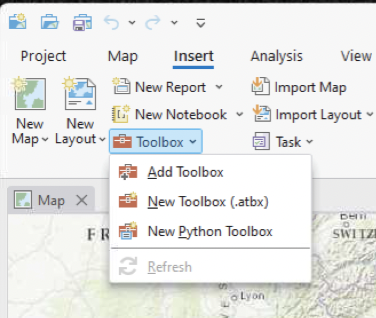
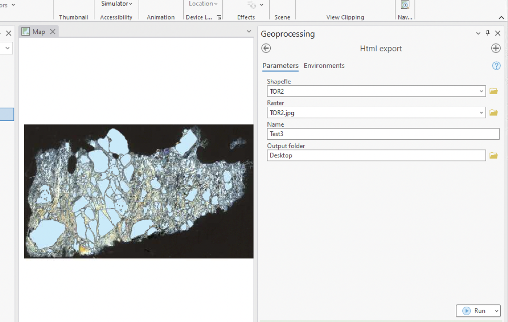

# How to use toolbox in ESRI applications

## 1. ArcGIS Pro

Toolbox was developed using ArcGis Pro 3.2

1. Download [Metpetools_ArcGisPro.atbx](Metpetools_ArcGisPro.atbx)
2. Open a New or existing project
3. Go to Menù: Insert -> Toolbox -> Add Toolbox

4. In toolbox panel go to Metpetools and double click on shp2html

5. Set parameters, For more info please check metadata and guide editor inside toolbox

<!-- TODO -->
<!-- ## 2. ArcMap

Requirement: ArcGIS Desktop (ArcMap) version >= 10.4

1. Download [Metpetools_ArcMap.tbx](MetPetools_ArcMap.tbx)

and  -->