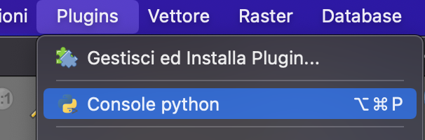
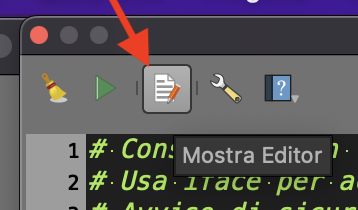
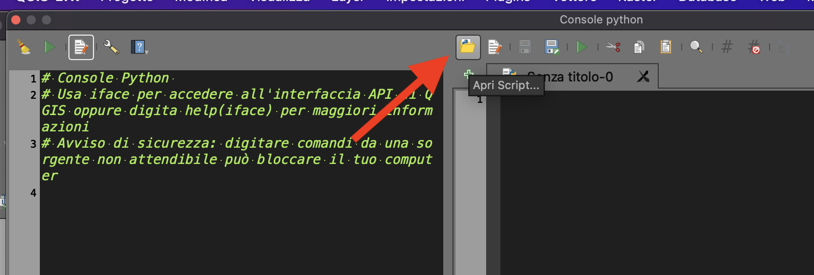
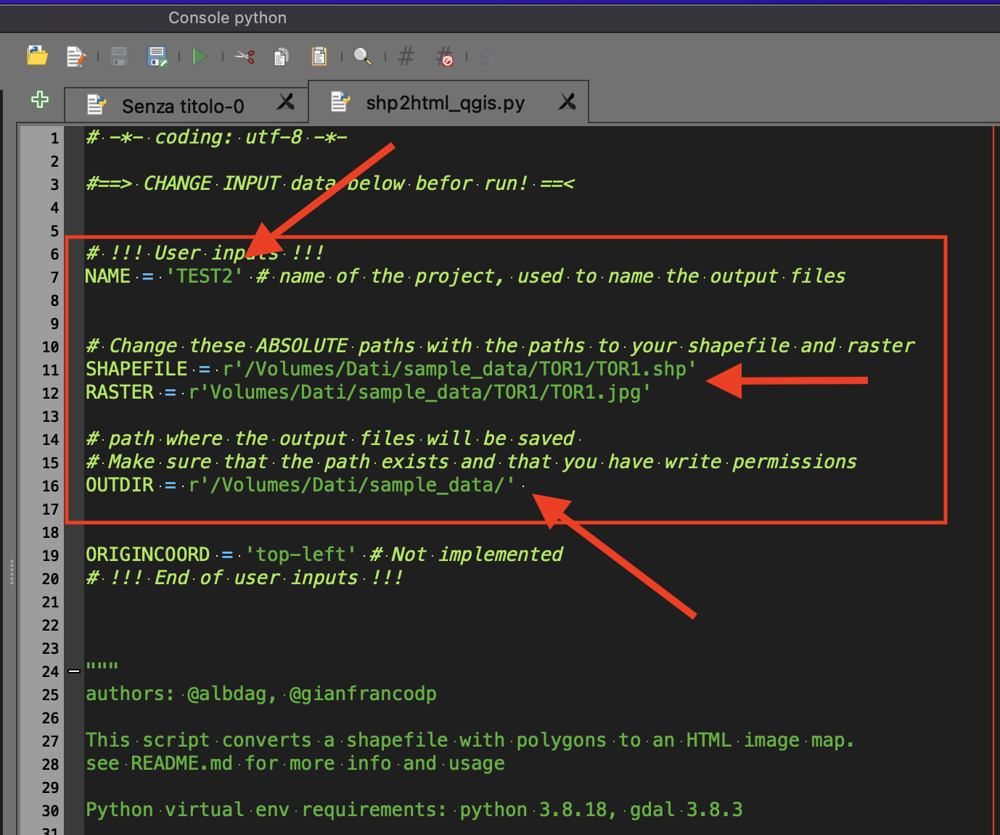

# How to use the scriptin Qgis application

1. Download [shp2html_qgis.py](Qgis%20processing%20script/shp2html_qgis.py) file
2. Open Qgis in your desktop
3. Go to menù Plugin -> Console Python

4. Click on "Show editor" icon

5. Click on "Open script icon"

6. Select the downloaded .py file
7. Change input data in the header of file

8. Click on "Run" (Play) icon.