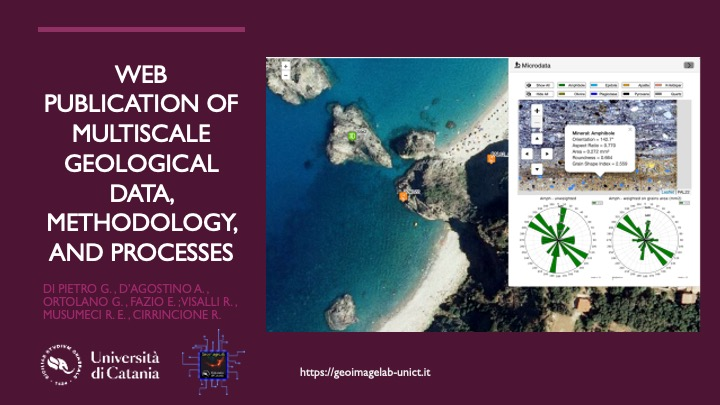

# Metpetools

After various decades of digital transition, publishing and spreading of geo-data actually is exclusively with Web and internet channels. Everybody know the effective communication and easy to access to the data and maps using web or mobile devices. The last decade of web-development and expecially web-gis technology development provided a very number of projects and libraries (OpenLayers, LeafLet etc..) for a better "production process" of geo-data publication on the web. Today especially in Opensource community we have a several front-end project that offer possibility to develop effective interface for data publishing on the web and mobile devices.

Geoscientists have a multitude of digital data across scales, across geometric types, across dataset types and more, such as Geo-graphic data, Geo-spatial data and Microscale-data.

**Metpetools** is a set of Python tools to create web-viewers of geological data provided from different type of analysis. A frist version of this project provided a multiscale web publication process for the site of Palmi shear zone  (Italy). A complex web-GIS viewer that contain different type of data at different scale: from microstructural data of thin section provided in a LIS-viewer (Litologic Information Sistem), a 3D model viewer of outcrops.

---

## Table of contents

1. [Making a Web viewer of a "Thin section" (LIS) from data](#1-making-a-web-viewer-of-a-thin-section-lis-from-data)
    - 1.1. [Python Environment](#11-python-and-enviromnent-main-requirements)
    - 1.2. [Credit and Library used](#12-credits-and-library-used)
    - 1.3. [Vector file specification](#13-vector-file-specification-details)
    - 1.4. [Raster file specification](#14-raster-file-specification)
    - 1.5. [Adding popup feature](#15-add-popup-to-the-map)
    - 1.6. [Add mineral legend and rose diagram](#16-add-mineral-legend-and-rosediagrams)
2. [3D viewer of a KMZ model](#2-3d-viewer-of-a-kmz-model)
    - 2.1 [Introduction](#21-introduction)
    - 2.2 [Python environment requirements](#22-python-environment-requirements)
    - 2.3 [Html template](#23-the-html-template-file)
    - 2.4 [Local folder files](#24-the-three-local-folder)
3. *Pakaging all into a web-gis framwork* (UNDER DEVELOPMENT)

Actual version proposed is used in:

Di Pietro, G., D’Agostino, A., Ortolano, G., Fazio, E., Visalli, R., Musumeci, R.E., Cirrincione, R., 2024. Web publication of multiscale geological data, methodology, and processes. [DOI: 10.13140/RG.2.2.34955.50726](https://doi.org/10.13140/RG.2.2.34955.50726) (keynote available)

---

## 1. Making a Web viewer of a "Thin section" (LIS) from data

The file [`lis_functions.py`](LIS/lis_functions.py) contain the Python scripts and function to make a webviewe of a thin section and grain poligons from scratch using GDAL, Beautiful Soup in a Python environment.

Tu use in your enviroment you can use the [`lis_functions.py`](LIS/lis_functions.py) file as importing function, but please refer to [`requirements.txt`](LIS/requirements.txt) for a proper python environment.

Also described in the [notebook example](LIS/LIS_of_a_thinSection.ipynb), the process is a sequence of these phases:

1. Import files
2. Create Raster tiles using Gdal
3. Convert SHP to Geojson using GDAL ogr2ogr
4. Add GeoJson overlay to web-viewer
5. Add pop-up feature to the map
6. Add rosediagram and legend feature to the webpage

Please refer to the [notebook example](LIS/LIS_of_a_thinSection.ipynb) to see a complete and working test.

|Function name| Description|
|---|---|
|`upload_files_widgets`|Using *ipywidgets* to create a file upload widget for the file upload in Jupyter Notebook|
|`save_to_temp_dir`|Save to temporary directory the file uploaded by the user in Jupyter Notebook using *upload_files_widgets*|
|`run_gdal2tiles`|Run *gdal2tiles.py* command to create tiles from a raster file|
|`convert_shp_to_geojson`|Script to convert SHP into GeoJSON using ogr2ogr|
|`add_geojson_overlay_to_gdal2tiles_html_output`|Function script to append a GeoJSON overlay to the HTML created with *gdal2tiles*|
|`add_popup_feature_to_gdal2tiles_html_output`|Function script to append JS and CSS link of PopUp Feature to the HTML created with *gdal2tiles* and %append_js_to_html function|
|`add_legend_and_rosediagrams`|dd the legend icons to the HTML file and the Javascript code to update the rose diagrams based on the mineral name|

### 1.1 Python and enviromnent main requirements

- Python 3
- GDAL
- beautifulsoup4==4.12.3
- ipython==8.12.3
- ipywidgets==8.1.2

### 1.2 Credits and library used

- ["OpenLayers" Library](https://github.com/openlayers/openlayers)
- "OpenLayer Extension" AKA `ol-ext` ([source code](https://github.com/Viglino/ol-ext?tab=readme-ov-file)) released under BSD 3-Clause License. Copyright (c) 2016-2021, Jean-Marc Viglino, IGN-France [All rights reserved](https://github.com/Viglino/ol-ext?tab=BSD-3-Clause-2-ov-file)
- [GDAL](https://gdal.org/en/latest/index.html) and [gdal2tiles](https://gdal.org/en/latest/programs/gdal2tiles.html) © 1998-2024 Frank Warmerdam, Even Rouault, and others
- [Beautiful Soap](https://www.crummy.com/software/BeautifulSoup/) 1996-2024 Leonard Richardson. Unless otherwise noted, Creative Commons License.
- [GeoJSON](https://geojson.org/) standard definition [RFC7946](https://datatracker.ietf.org/doc/html/rfc7946) (Butler et al, 2016)
- [Micro-Fabric Analyzer (MFA)](https://www.mdpi.com/2220-9964/10/2/51) (Visalli et al, 2021).
- [Quantitative X-ray Map Analyser (Q-XRMA)](https://www.sciencedirect.com/science/article/pii/S0098300417306982) (Ortolano et al, 2018)
- ["ArcStereoNet](https://doi.org/10.3390/ijgi10020050): A New ArcGIS® Toolbox for Projection and Analysis of Meso- and Micro-Structural Data" (Ortolano et al, 2021)

### 1.3 Vector File specification details

<u>**Shapefile**</u>: the minimum collection of 4 files [.shp, .dbf, .shx, .cpg] in ESRI standard format. the shapefile will be converted in GeoJSON format by `ogr2ogr` subprocess. The Shapefile must cointain polygons of mineral of the thin section.

#### 1.3.1 Field table definition used in this LIS and stored in Shapefile

|Field name|type|example value|NOTE|
|---|---|---|---|
|*Mineral*|str|`Pl`|Coded name of mineral|
|O|float|`90.0`|Degree of orientation|
|Asr|float|`0.39438`|Aspect Ratio|
|A|float|`0.12928`|Area in micrometers|
|R|float|`0.58411`|Roundness|
|GSI|float|`1.87833`|Grain Shape Index|

The code of minerals to use is reported in the following table:

#### 1.3.2 Codename of mineral used

|*Code*|Mineral name|
|---|---|
|Amph|Amphibole|
|Ep|Epidote|
|Ap|Apatite|
|Kfs|K-Feldspar|
|Ol|Olivine|
|Pl|Plagioclase|
|Px|Pyroxene|
|Qtz|Quartz|

In the example polygons are generated by these tools:
- [Micro-Fabric Analyzer (MFA)](https://www.mdpi.com/2220-9964/10/2/51) (Visalli et al, 2021).
- [Quantitative X-ray Map Analyser (Q-XRMA)](https://www.sciencedirect.com/science/article/pii/S0098300417306982) (Ortolano et al, 2018)

### 1.4 Raster file specification 

<u>**Image**</u>: Through the use of gdal2tiles the original image is broken up into hundreds of small fragments (tiles) while maintaining the original characteristics. We do not suggest formats such as TIFF, JP2, ECW, etc., which although supported by gdal2tiles may not be readable by a web browser. Instead, we suggest using a more web-compatible format such as PNG or JPG for the raster.

NOTE: <u>**NO-Coordinate Reference System (NO-CRS)**</u>: check that both Shapefile and Image are correctly overlapped in a NO-CRS system. We only use the internal coordinate of the pixel of the raster, polygon vertex defined in Shapefile are referring to a specific pixel of the Imagefile.

### 1.5 Add popup to the map

The pop-up feature is provided using `ol-ex` a Javascript library "OpenLayer Extension".

For more info about `ol-ext` is [released](https://github.com/Viglino/ol-ext?tab=readme-ov-file) under BSD 3-Clause License. Copyright (c) 2016-2021, Jean-Marc Viglino, IGN-France [All rights reserved](https://github.com/Viglino/ol-ext?tab=BSD-3-Clause-2-ov-file).

The function **`add_popup_feature_to_gdal2tiles_html_output(Html_input,Html_output)`** work on an html file provided by function `add_geojson_overlay_to_gdal2tiles_html_output`. It only works if *Html_input* is the result of the process we are conducting.

This function follow these 3 steps:

1. Add a link to JS and CSS of `ol-ext` hosted by *cdn.jsdelivr.net* in the head and bottom of html_input
2. Add a customized script code with `ol.Overlay.PopupFeature()`
3. Add customized CSS that overrides some features for better visualization.

### 1.6 Add mineral legend and rosediagrams

With *ArcStereoNet* [*] or other software for analizing microstructural data of Thin section, we obtained a  weighted and unweighted rose diagrams based on grains cumulative area.

[*] Ortolano, Gaetano, Alberto D’Agostino, Mario Pagano, Roberto Visalli, Michele Zucali, Eugenio Fazio, Ian Alsop, and Rosolino Cirrincione. 2021. "ArcStereoNet: A New ArcGIS® Toolbox for Projection and Analysis of Meso- and Micro-Structural Data" ISPRS International Journal of Geo-Information 10, no. 2: 50. https://doi.org/10.3390/ijgi10020050

After this, we stored SVGs files of rosediagrams in `example_data\asset\rose`. 

The feature that we are adding must provide an interaction with the user that every click on a polygon corresponding an action of modification of the webpage. If the user click on a "Quartz"-classified polygon, the webviewer provide the "Quartz" rose-diagram. 

Another related feature is the ability to show and query the rosediagram results by clicking a button representing a mineral type. This requires a button for each type of mineral classified in the thin section. We create these buttons using a common graphic software and store it in the `example_data\asset\legend`. 

The function `add_legend_and_rosediagrams` will modify the html produced by steps before in this way:

1. Copy files of rosediagram and legend buttons in an appropriate subfolder
2. Adds a "blank rose diagram" for the case of "other" or empty mineral result from query.
3. Using Beautidul Soup inserts in the html some Javascript code and new Html tags for the legend and the rosediagrams.
4. Resizes the height of the map and modifies other style and script settings for better result.

The function `add_legend_and_rosediagrams` works with the list of file paths used for the rosediagram and legend buttons. In this example, we provide two simple dict variables that contain the *mineral code* and the relative file path.

---

## 2. 3D Viewer of a KMZ model

A comprehensive working example of a 3D viewer is provided within the directory designated [3D/TEST11](3D/TEST11).
The procedure for generating a customized web viewer is meticulously outlined within the computational notebook located at [3D/kmz2html.ipynb](3D/kmz2html.ipynb).  To replicate this process, it is recommended to download the entirety of the [3D](3D) directory of this repository into your Python environment and utilize the provided example notebook as a reference.

### 2.1 Introduction

The web-based representation of three-dimensional objects is achieved through the utilization of 3D rendering libraries designed for geometric models. Among these, the predominant free and open-source solution is [Three.JS](https://github.com/mrdoob/three.js/), a JavaScript library renowned for its capacity to manage both raw geometric data and models conforming to standardized formats.

This particular implementation employs the [KMZ Loader](https://github.com/mrdoob/three.js/blob/dev/examples/jsm/loaders/KMZLoader.js), an add-on module within the Three.JS framework, enabling the seamless integration of KMZ files.

### 2.2 Python Environment Requirements

using `pip` to install these dependencies

* os
* ZipFile
* ipywidgets
* IPython.display

### 2.3 The *html-template* file

The file [htmltemplate.py](htmltemplate.py) contains a collection of string variables storing the HTML structure of a 3D model viewer, along with auxiliary functions.  Leveraging Python, this structure facilitates the dynamic generation of customized HTML, tailored to specific input data. To enhance comprehension of the process involved in packaging this web viewer, a step-by-step analysis of the HTML elements is employed.

The subsequent sequence of items adheres to the order of variables and functions utilized:

|Variable of function name|Description|
|---|---|
|1. `KMZ_HTMLHEAD`| Html header, title of page and simple meta tag|
|2. `KMZ_IMPORTLIBS`|Script for import Three.JS from a CDN server, in this version we use unpkg.com|
|3. `KMZ_THREEJS_ADDONS_FILES_ADD_TO_PROJECT(projectName)`|Function to create folder and file for packaging|
|4. `KMZ_OPENINGSCRIPT`|the html row of script that open customized code for viewer|
|5. `KMZ_LOADINGIMAGE(SPLASHIMAGE_URI)`|Function to create Javascript code that load an GIFimage as a splash screen|
|6. `KMZ_THREEJS_script(KMZ_URI)`|Function to create JS code for loading an KMZ file|
|7. `KMZ_CLOSINGSCRIPT`|String with HTML code for closing script tag|
|8. `KMZ_STYLE`|Html code with CSS nested|
|9. `KMZ_HTMLFOOT`|Html code with closing tag and footer|

The more important step is the #6. For a better viewing there are essential little customization to do with every specific model.

- Set or fix custom coordinates of the center position of the model loaded using `KMZLoader` JS function
- Set or fix custom coordinates of camera center using `THREE.PerspectiveCamera` JS function
- Set different light and rendering options.

It is recommended to implement these modifications directly within the HTML/JavaScript code following the generation of the initial HTML structure using Python. Identifying the specific values requiring adjustments for coordinates and other variables is a straightforward process within this context.

### 2.4 The *three* local folder

Due to the inherent limitations of Content Delivery Networks (CDNs) in effectively serving these specific files, and to mitigate potential complications arising from Cross-Origin Resource Sharing (CORS) restrictions, a preferred strategy involves their local storage and retrieval directly within the KMZ model file.

The [three](three) subfolder contains add-ons and other JavaScript files imported from the Three.JS project. All of this files is a dump copy from [Three.JS](https://github.com/mrdoob/three.js/).

For maintaing the default structure of Three.JS there are stored using the structure: `three/addons/jsm` inside this folder there are 3 subfolders:

- `three/addons/jsm/controls` It contain the *OrbitControl* module for navigation feature of 3D scene
- `three/addons/jsm/libs` It contain *fflate* module (fast JavaScript compression/decompression) for increase rendering speed
- `three/addons/jsm/loaders` It contain *ColladaLoader*, *KMZLoader* and *TGALoader* modules of Three.Js