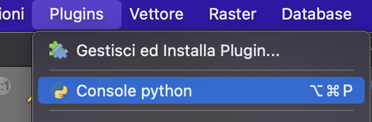
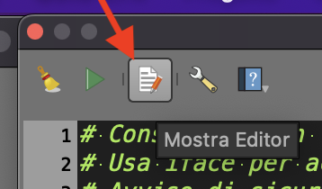
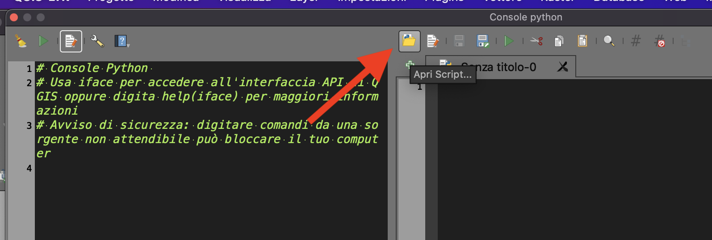
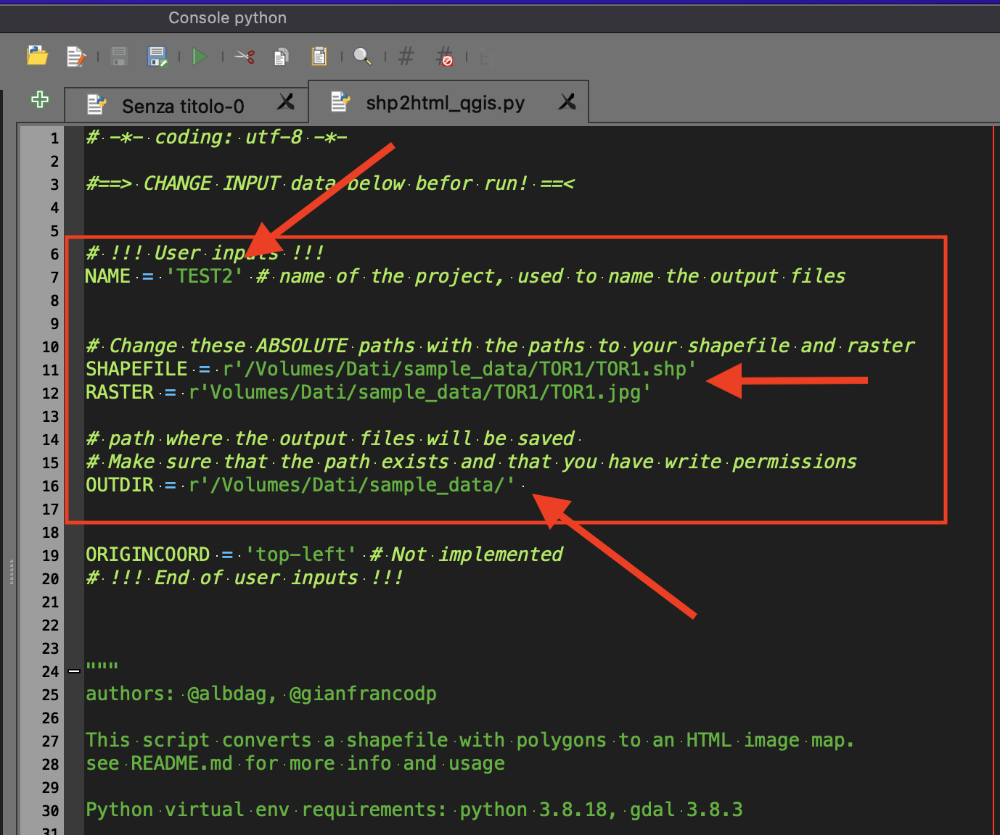

# How to use the script in Qgis application

1. Download [shp2html_qgis.py](shp2html_qgis.py) file
2. Open Qgis in your desktop
3. Go to menù Plugin -> Console Python

4. Click on "Show editor" icon

5. Click on "Open script icon"

6. Select the downloaded .py file
7. Change input data in the header of file

- **Check write permission on output folder**
- Do not use the same folder of input files

8. Click on "Run" (Play) icon.
